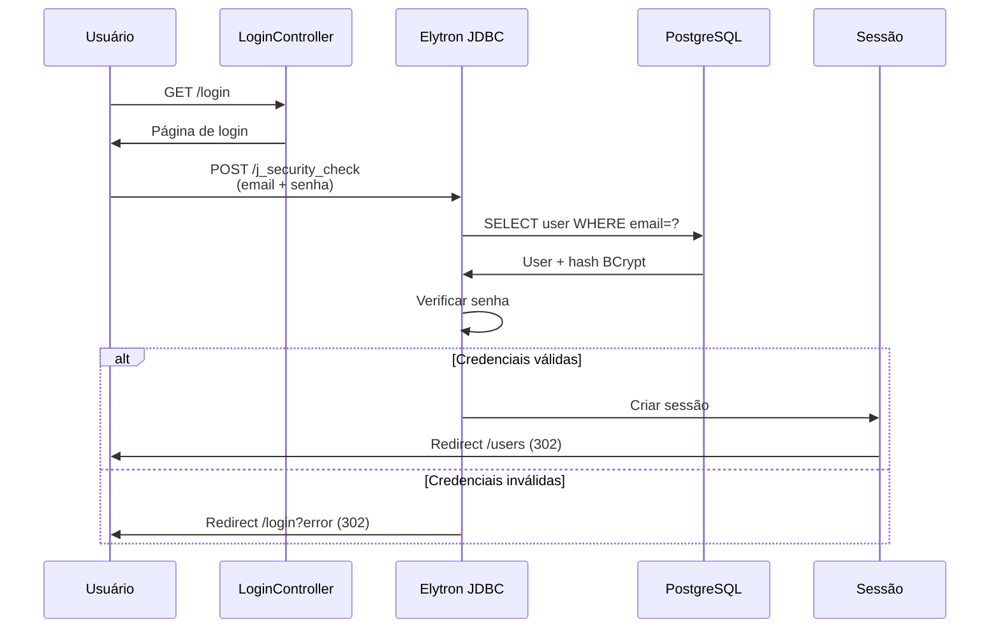
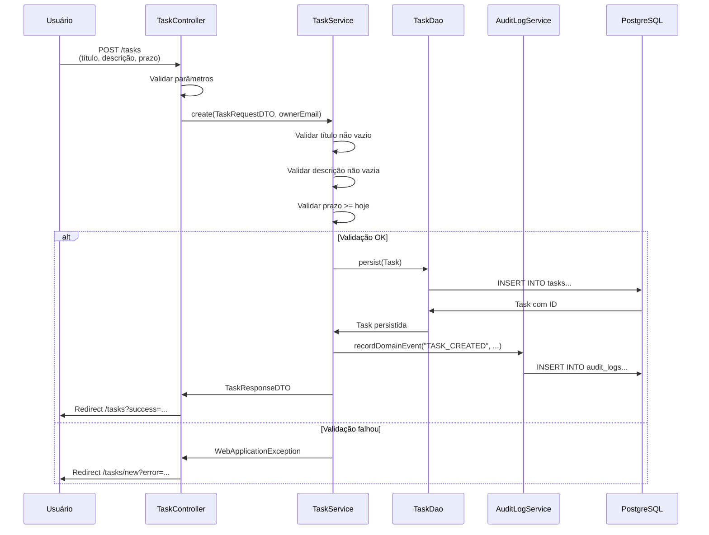
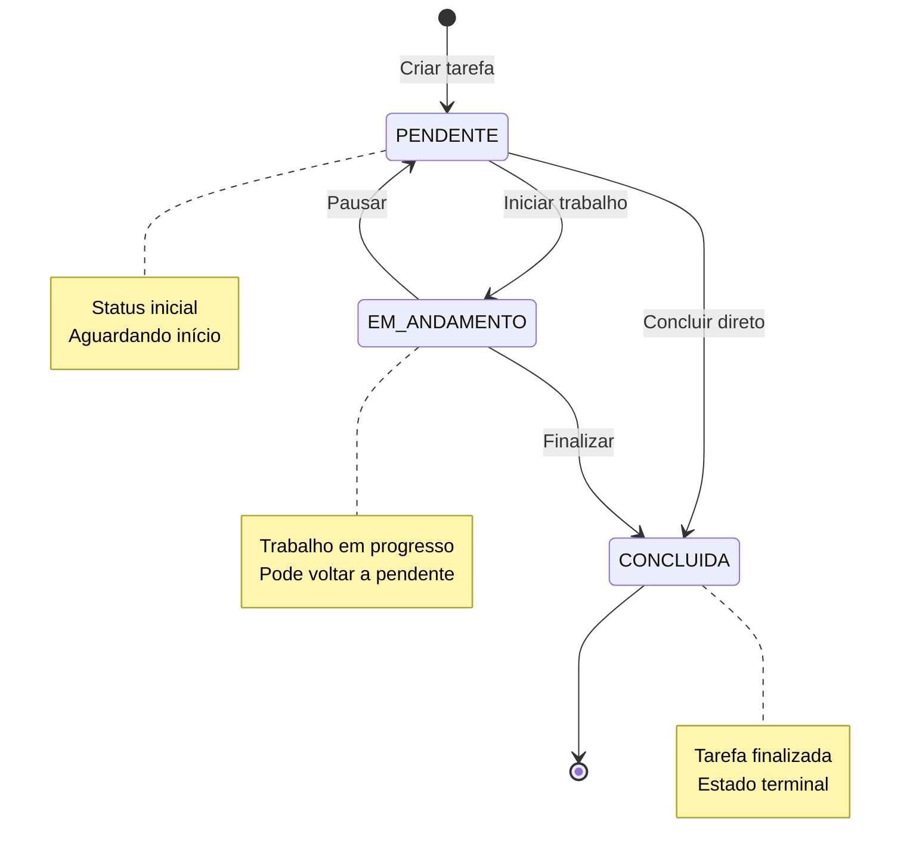
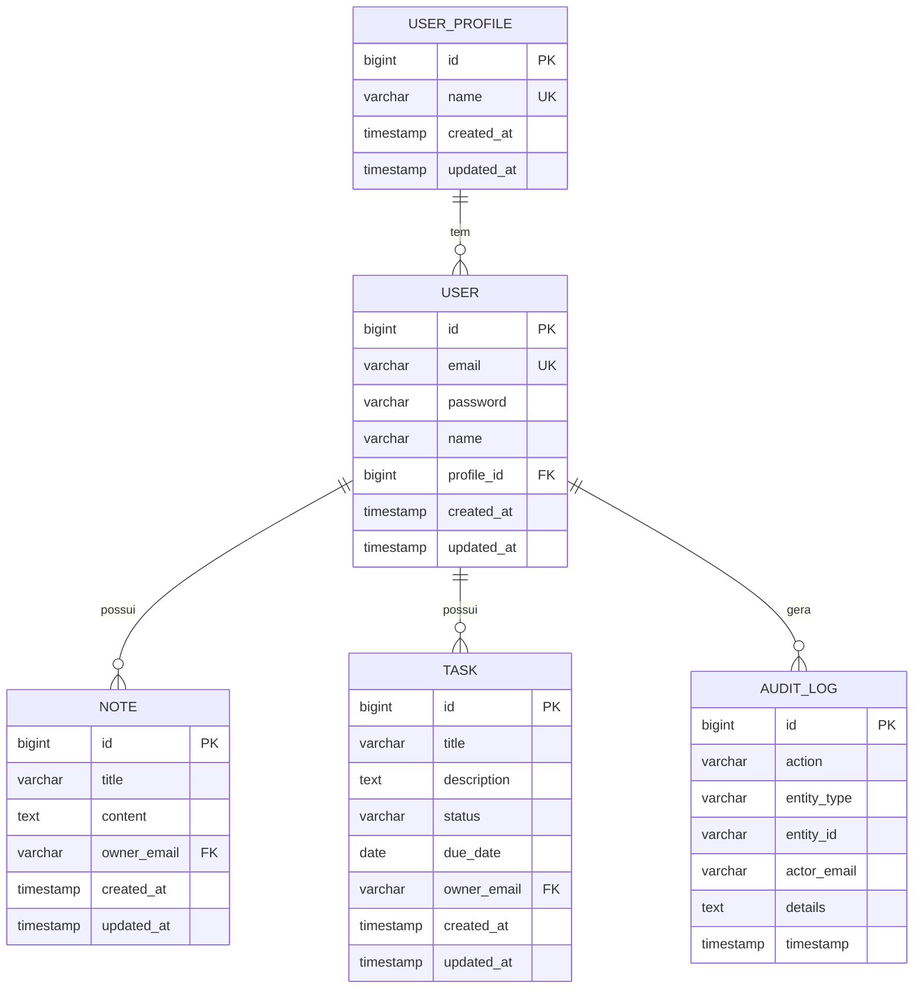
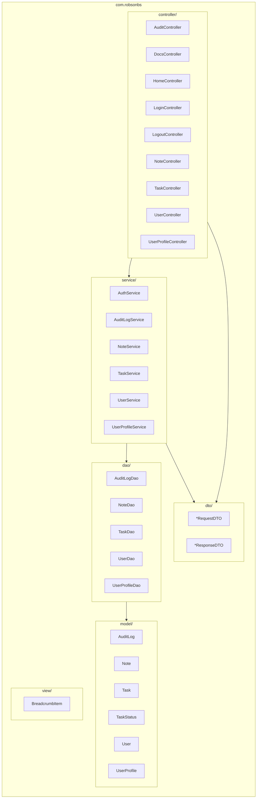
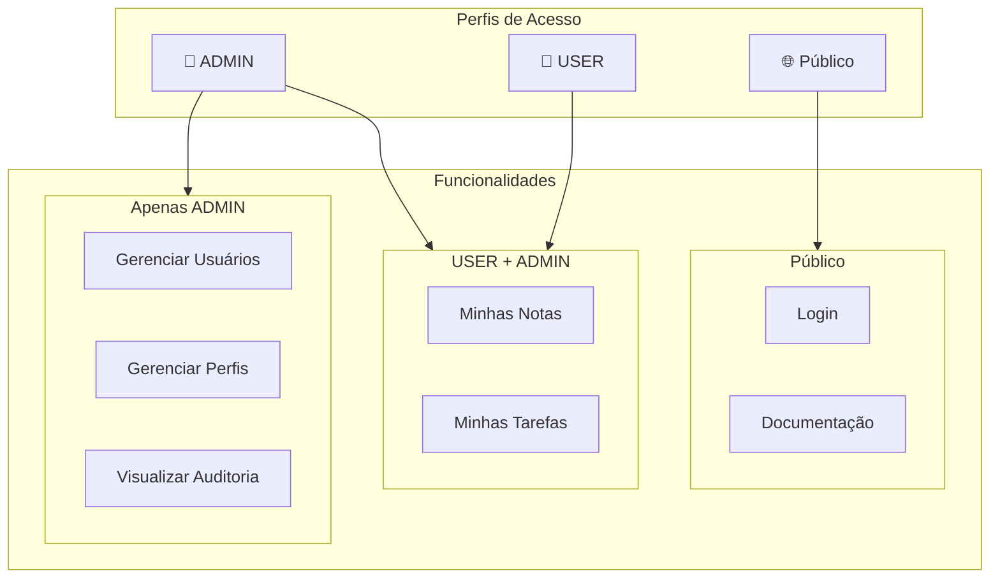
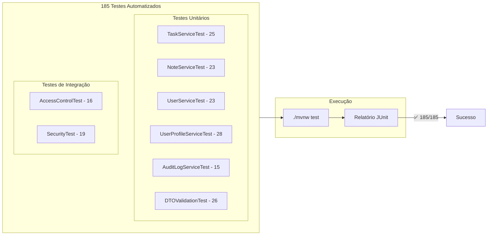
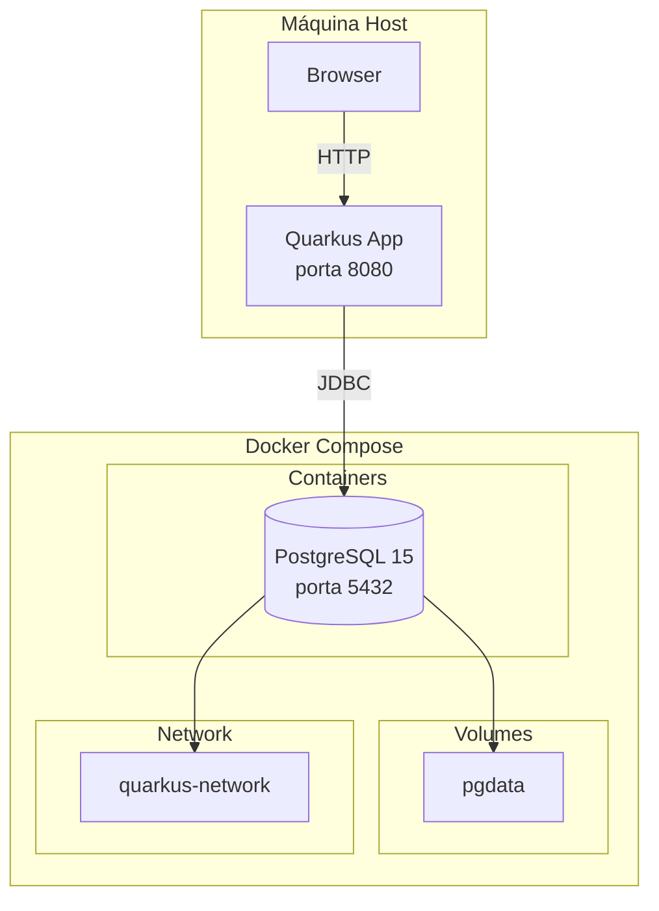

# 🏗️ Diagramas de Arquitetura

## Visão Geral da Arquitetura MVC

```mermaid
flowchart TB
    subgraph Apresentacao["📱 Camada de Apresentação"]
        direction LR
        T[Templates Qute]
        Tags[Tags Reutilizáveis]
        CSS[Tailwind CSS]
    end

    subgraph Controller["🎮 Camada Controller"]
        direction LR
        UC[UserController]
        NC[NoteController]
        TC[TaskController]
        AC[AuditController]
        LC[LoginController]
    end

    subgraph Service["⚙️ Camada Service/BO"]
        direction LR
        US[UserService]
        NS[NoteService]
        TS[TaskService]
        AS[AuditLogService]
        Auth[AuthService]
    end

    subgraph DAO["💾 Camada DAO"]
        direction LR
        UD[UserDao]
        ND[NoteDao]
        TD[TaskDao]
        AD[AuditLogDao]
    end

    subgraph Model["📦 Camada Model"]
        direction LR
        UE[User]
        NE[Note]
        TE[Task]
        AE[AuditLog]
        UP[UserProfile]
    end

    subgraph DB["🗄️ Banco de Dados"]
        PG[(PostgreSQL 15)]
    end

    Apresentacao --> Controller
    Controller --> Service
    Service --> DAO
    DAO --> Model
    Model --> DB
```



---

## Fluxo de Autenticação



---

## Fluxo de Criação de Tarefa



---

## Workflow de Status de Tarefas



---

## Modelo de Dados (ERD)



---

## Estrutura de Pacotes



---

## Fluxo de Requisição HTTP

```mermaid
flowchart LR
    subgraph Cliente
        Browser[🌐 Browser]
    end
    
    subgraph Quarkus["Quarkus Server"]
        direction TB
        
        Filter[SecurityFilter]
        Router[JAX-RS Router]
        
        subgraph Controllers
            UC[UserController]
            NC[NoteController]
            TC[TaskController]
        end
        
        subgraph Templates
            Qute[Qute Engine]
            HTML[HTML Response]
        end
    end
    
    Browser -->|HTTP Request| Filter
    Filter -->|Authenticated| Router
    Router --> Controllers
    Controllers --> Qute
    Qute --> HTML
    HTML -->|HTTP Response| Browser
    
    Filter -->|Not Authenticated| Login[/login]
    Login --> Browser
```

---

## Controle de Acesso por Perfil



---

## Pipeline de Testes



---

## Infraestrutura Docker



---

## Como usar estes diagramas

### No GitHub/GitLab

Os diagramas Mermaid são renderizados automaticamente em arquivos `.md` .

### Em apresentações

1. Acesse [Mermaid Live Editor](https://mermaid.live/)
2. Cole o código do diagrama
3. Exporte como PNG ou SVG

### No VS Code

Instale a extensão "Markdown Preview Mermaid Support" para visualizar.

### Ferramentas alternativas

* [Draw.io](https://draw.io) - Para edição visual
* [PlantUML](https://plantuml.com) - Sintaxe alternativa
* [Lucidchart](https://lucidchart.com) - Edição colaborativa
