# 📊 Diagramas de Classes

> 20 diagramas Mermaid detalhados do Sistema de Gestão de Notas e Tarefas.

---

## 📋 Índice

01. [Visão Geral do Sistema](#1-visão-geral-do-sistema)
02. [Camada de Modelo (Entidades)](#2-camada-de-modelo-entidades)
03. [Hierarquia de Usuários e Perfis](#3-hierarquia-de-usuários-e-perfis)
04. [Entidades de Domínio](#4-entidades-de-domínio)
05. [Enum TaskStatus](#5-enum-taskstatus)
06. [Camada DAO](#6-camada-dao)
07. [Padrão Repository com Panache](#7-padrão-repository-com-panache)
08. [Camada de Serviços](#8-camada-de-serviços)
09. [UserService Detalhado](#9-userservice-detalhado)
10. [TaskService Detalhado](#10-taskservice-detalhado)
11. [NoteService Detalhado](#11-noteservice-detalhado)
12. [AuditLogService Detalhado](#12-auditlogservice-detalhado)
13. [Camada de Controllers](#13-camada-de-controllers)
14. [UserController Detalhado](#14-usercontroller-detalhado)
15. [TaskController Detalhado](#15-taskcontroller-detalhado)
16. [DTOs de Request](#16-dtos-de-request)
17. [DTOs de Response](#17-dtos-de-response)
18. [Componentes de Segurança](#18-componentes-de-segurança)
19. [Filtros e Interceptadores](#19-filtros-e-interceptadores)
20. [Arquitetura Completa MVC](#20-arquitetura-completa-mvc)

---

## 1. Visão Geral do Sistema

Diagrama de alto nível mostrando as principais camadas e suas relações.

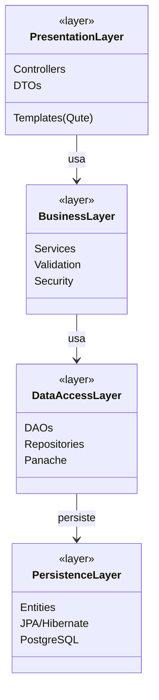

---

## 2. Camada de Modelo (Entidades)

Todas as entidades JPA do sistema e seus relacionamentos.

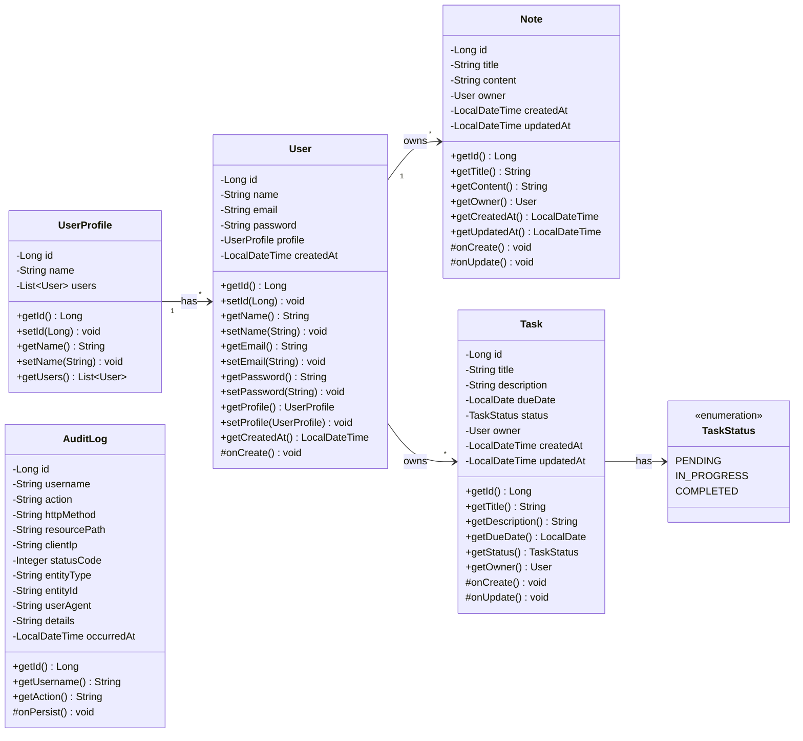

---

## 3. Hierarquia de Usuários e Perfis

Relacionamento detalhado entre User e UserProfile.

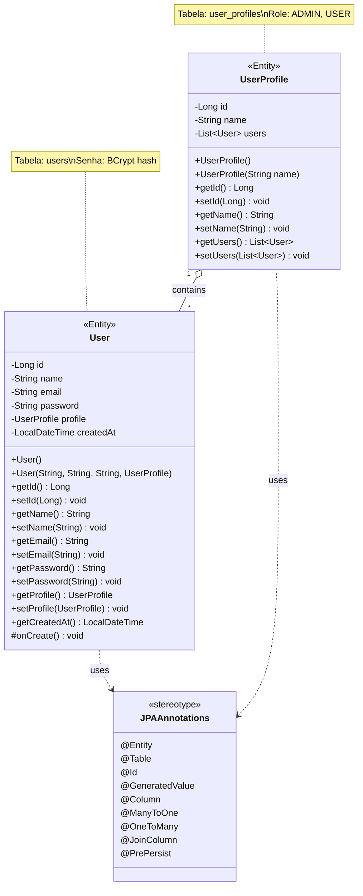

---

## 4. Entidades de Domínio

Detalhamento de Note e Task com lifecycle callbacks.

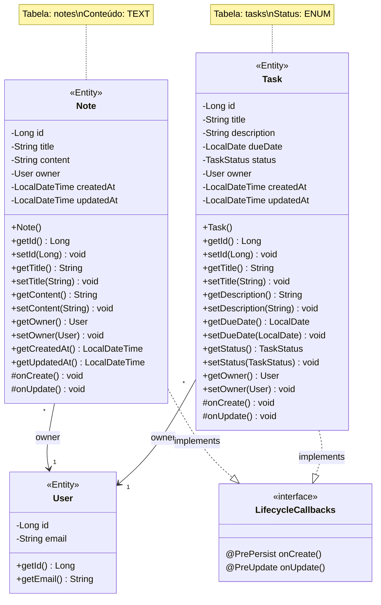

---

## 5. Enum TaskStatus

Máquina de estados das tarefas.

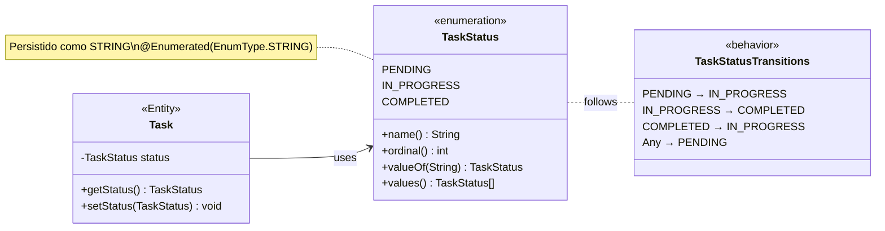

---

## 6. Camada DAO

Todos os DAOs (Data Access Objects) do sistema.

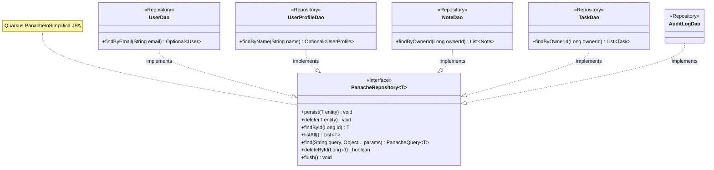

---

## 7. Padrão Repository com Panache

Detalhamento do padrão Repository implementado.

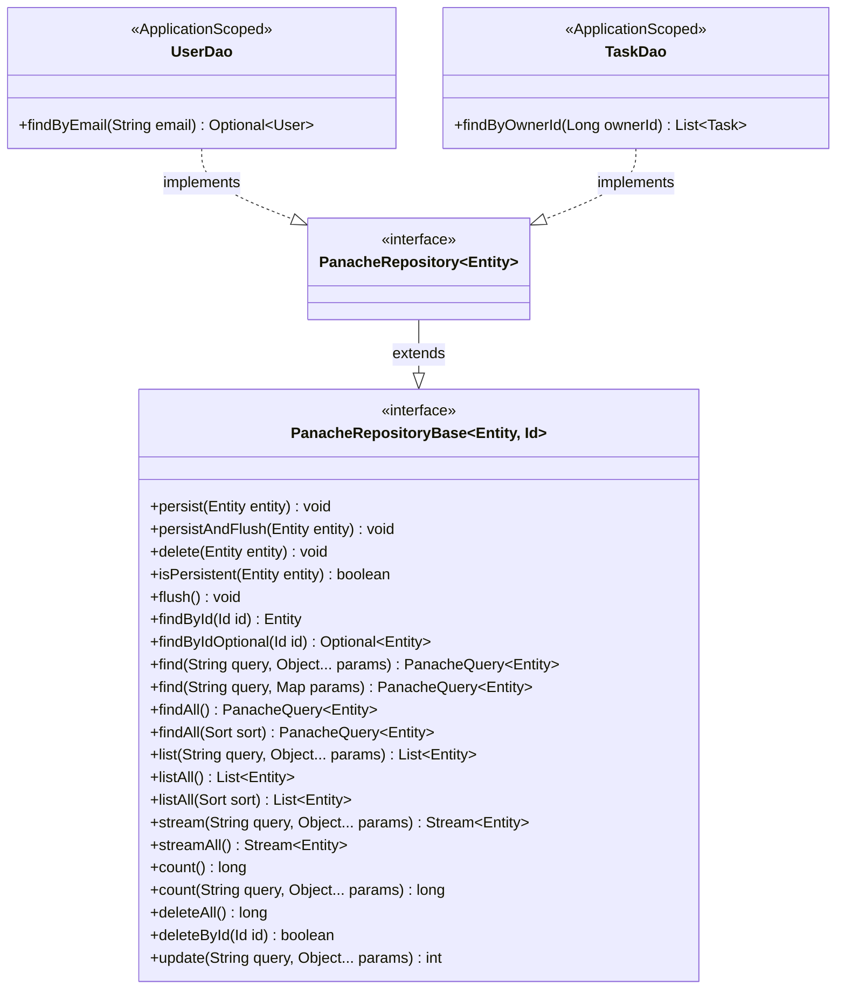

---

## 8. Camada de Serviços

Todos os Services com suas dependências.

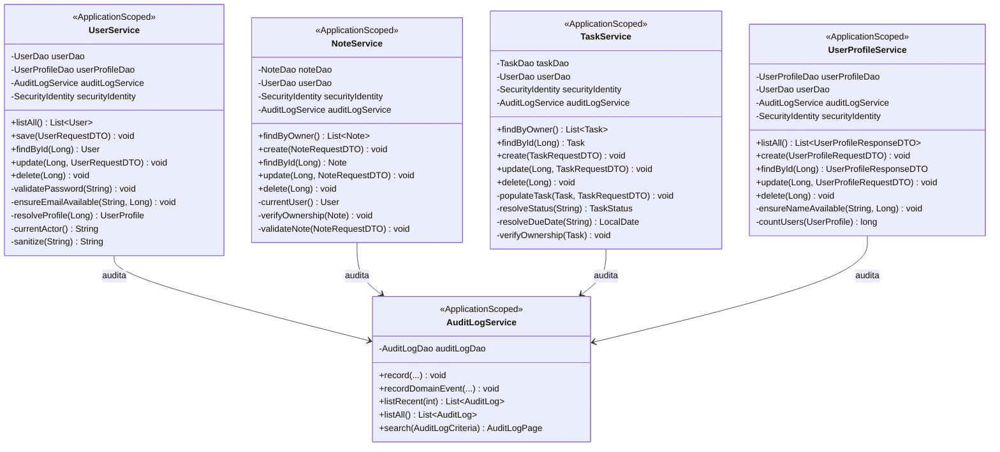

---

## 9. UserService Detalhado

Serviço de usuários com todas as operações.

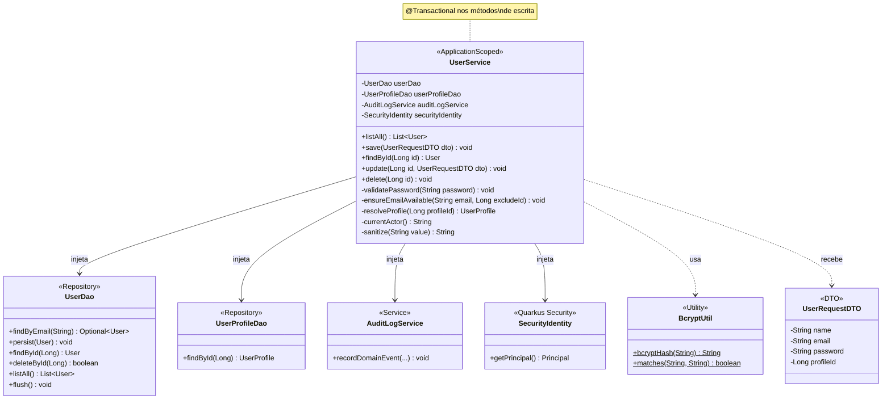

---

## 10. TaskService Detalhado

Serviço de tarefas com validações.

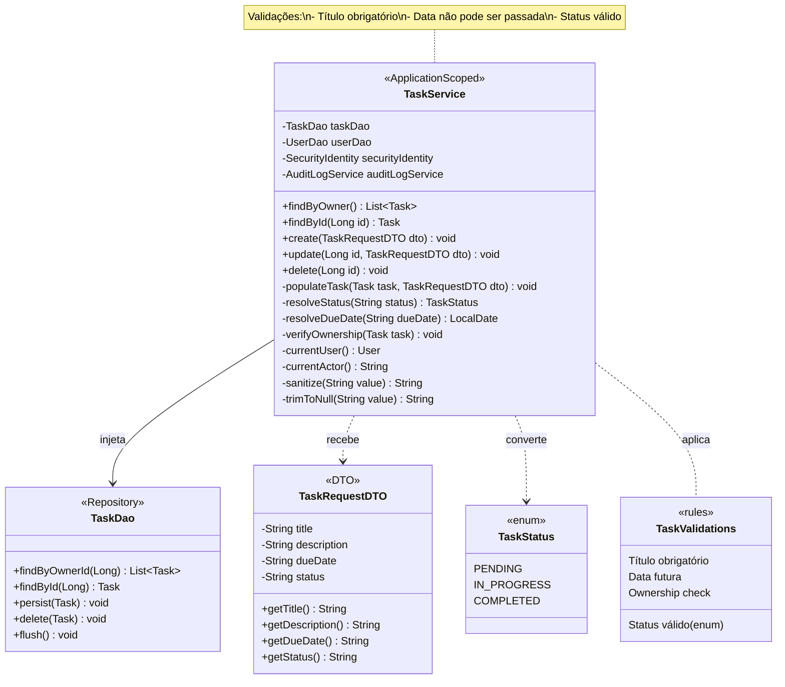

---

## 11. NoteService Detalhado

Serviço de notas com ownership.

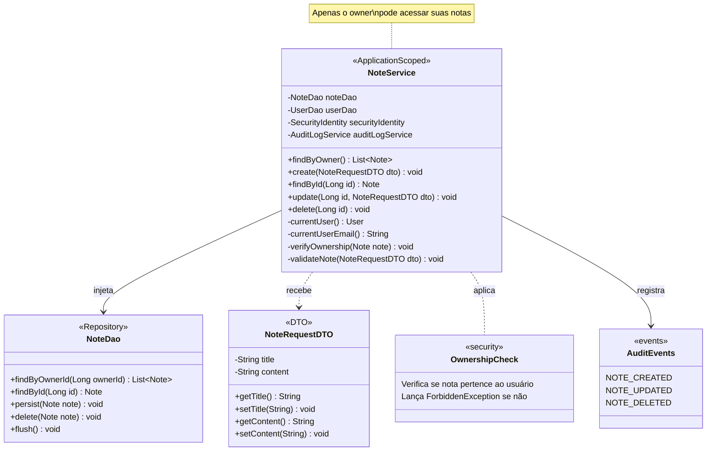

---

## 12. AuditLogService Detalhado

Serviço de auditoria com busca paginada.

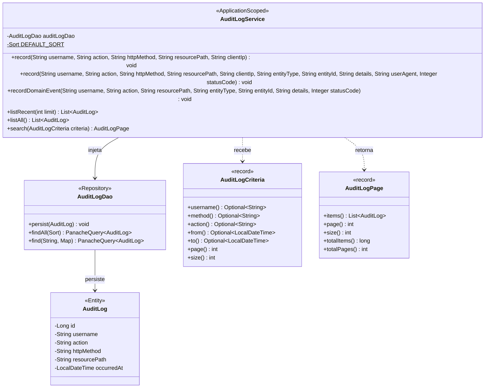

---

## 13. Camada de Controllers

Todos os controllers REST do sistema.

```mermaid
classDiagram
    direction TB
    
    class UserController {
        <<JAX-RS>>
        @Path("/users")
        @Blocking
        -UserService userService
        -UserProfileService userProfileService
        -Template users
        -Template userForm
        +listUsers() TemplateInstance
        +newUserForm() TemplateInstance
        +createUser(UserRequestDTO) Response
        +getUser(Long) TemplateInstance
        +updateUser(Long, UserRequestDTO) Response
        +deleteUser(Long) Response
    }
    
    class TaskController {
        <<JAX-RS>>
        @Path("/tasks")
        @RolesAllowed(USER, ADMIN)
        -TaskService taskService
        -Template tasks
        -Template taskForm
        +listTasks() TemplateInstance
        +newTaskForm() TemplateInstance
        +createTask(TaskRequestDTO) Response
        +editTask(Long) TemplateInstance
        +updateTask(Long, TaskRequestDTO) Response
        +deleteTask(Long) Response
    }
    
    class NoteController {
        <<JAX-RS>>
        @Path("/notes")
        @RolesAllowed(USER, ADMIN)
        -NoteService noteService
        -Template notes
        -Template noteForm
        +listNotes() TemplateInstance
        +newNoteForm() TemplateInstance
        +createNote(NoteRequestDTO) Response
        +editNote(Long) TemplateInstance
        +updateNote(Long, NoteRequestDTO) Response
        +deleteNote(Long) Response
    }
    
    class UserProfileController {
        <<JAX-RS>>
        @Path("/profiles")
        @RolesAllowed(ADMIN)
        -UserProfileService service
        -Template profiles
        -Template profileForm
        +listProfiles() TemplateInstance
        +newProfileForm() TemplateInstance
        +createProfile(UserProfileRequestDTO) Response
        +editProfile(Long) TemplateInstance
        +updateProfile(Long, UserProfileRequestDTO) Response
        +deleteProfile(Long) Response
    }
    
    class AuditController {
        <<JAX-RS>>
        @Path("/audit")
        @RolesAllowed(ADMIN)
        -AuditLogService service
        -Template audit
        +listAuditLogs() TemplateInstance
    }
    
    class LoginController {
        <<JAX-RS>>
        @Path("/login")
        -Template login
        +loginPage() TemplateInstance
    }
    
    class LogoutController {
        <<JAX-RS>>
        @Path("/logout")
        +logout() Response
    }
    
    class HomeController {
        <<JAX-RS>>
        @Path("/")
        -Template index
        +home() TemplateInstance
    }
```

---

## 14. UserController Detalhado

Controller de usuários com fluxo de redirecionamento.

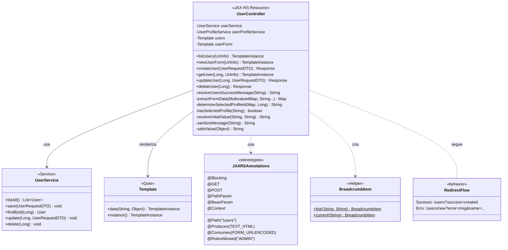

---

## 15. TaskController Detalhado

Controller de tarefas com validação de erros.

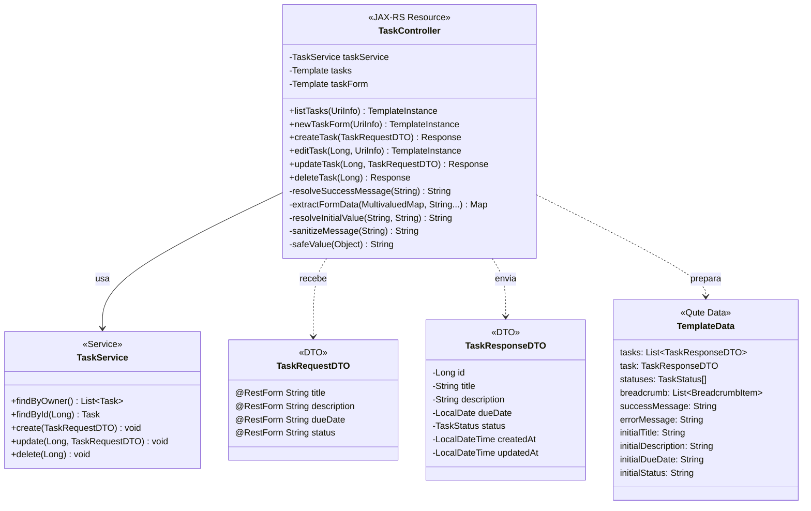

---

## 16. DTOs de Request

Todos os DTOs de entrada com anotações @RestForm.

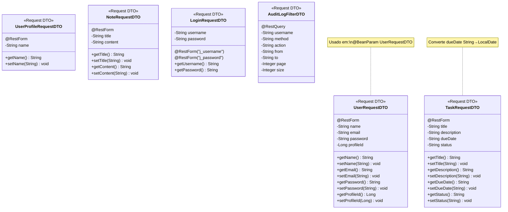

---

## 17. DTOs de Response

Todos os DTOs de saída para templates.

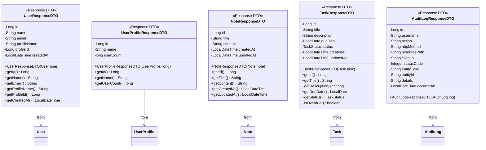

---

## 18. Componentes de Segurança

Sistema de autenticação e autorização.

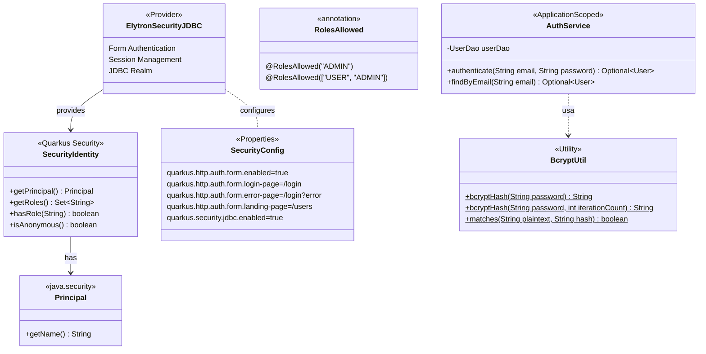

---

## 19. Filtros e Interceptadores

Componentes de interceptação de requisições.

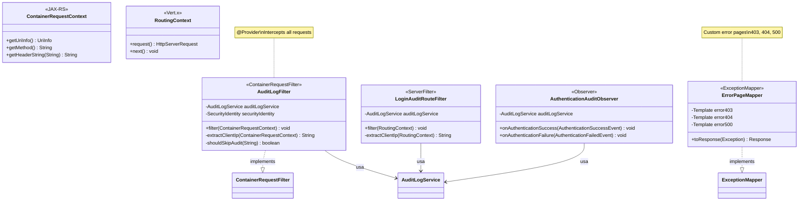

---

## 20. Arquitetura Completa MVC

Visão completa da arquitetura Model-View-Controller.

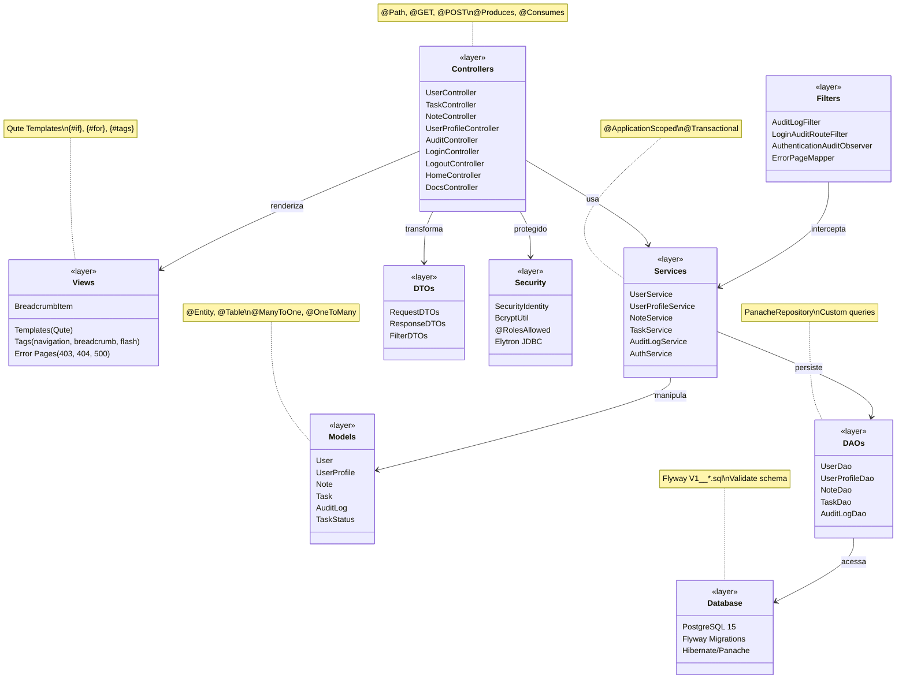

---

## 🔗 Referência Rápida

### Padrões Utilizados

| Padrão | Implementação |
|--------|---------------|
| **MVC** | Controllers + Qute + Entities |
| **Repository** | Panache DAOs |
| **DTO** | Request/Response DTOs |
| **Service Layer** | Business Logic Services |
| **Observer** | Authentication Events |
| **Filter** | Request Interceptors |

### Relacionamentos Entre Entidades

| Entidade | Relacionamento | Entidade |
|----------|----------------|----------|
| UserProfile | 1: N | User |
| User | 1: N | Note |
| User | 1: N | Task |
| Task | N:1 | TaskStatus |

### Fluxo de Dados

```
Request → Filter → Controller → Service → DAO → Database
                       ↓
                  Template (Qute)
                       ↓
                   Response
```

---

*Diagramas criados com Mermaid - Janeiro 2025*
